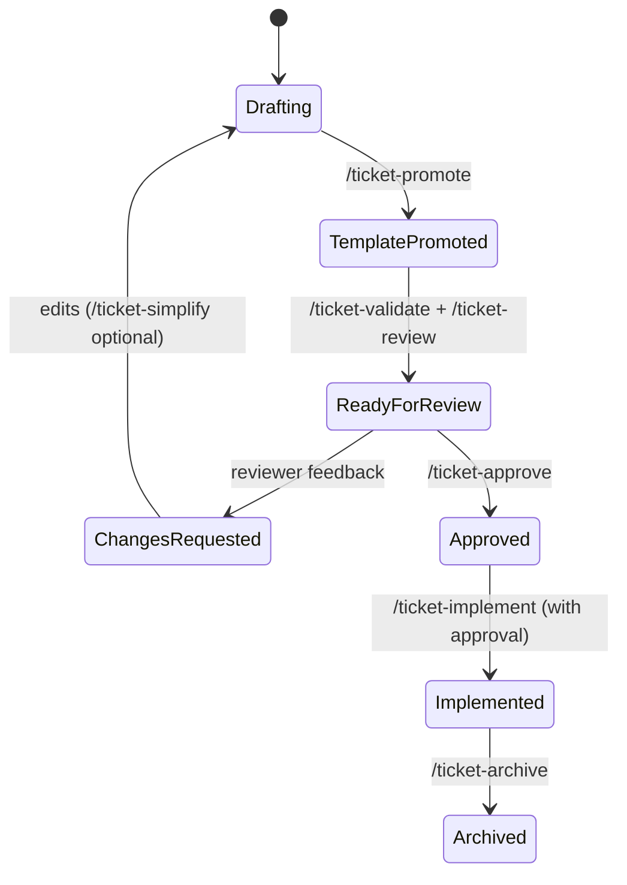

# Ticket Workflow (Agent ↔ User) — Chat-first with Minimal Commands

**Purpose**: Standardize how tickets move from brainstorming to approved/implemented using simple, low‑argument commands. Keep final tickets minimal and consistent with `linear/docs/templates/ticket-template.md`.

## Defaults

- Final output matches `linear/docs/templates/ticket-template.md` exactly with a single DoD list
- Default DoD tier: Standard (override during triage if needed)
- Draft naming: `linear/tickets/drafts/{TEAM}-{slug}-draft.md`
- Commands: `/ticket-new`, `/ticket-wizard`, `/ticket-validate`, `/ticket-simplify`, `/ticket-promote`, `/ticket-draft`, `/planning-mode`, `/plan-md`
- `GLB-TKT_Best_Practices.md` is drafting-only; never the final ticket
- Enforce ISO 8601 UTC for `created`/`updated` automatically at promote time

## State model (reusing front matter)

- `status`: Backlog | Draft | In Review | Approved | Deprecated
- `stage`: Planning | In Progress | Done

Recommended mapping:

- Drafting (best‑practices) → `status: Draft`, `stage: Planning`
- Template promoted → `status: Draft`, `stage: Planning`
- Ready for review → `status: In Review`, `stage: Planning`
- Approved → `status: Approved`, `stage: Planning`
- Implemented (Linear issue created) → `status: Approved`, `stage: In Progress`
- Archived/Obsolete → `status: Deprecated`, `stage: Done`

Always refresh `updated` (ISO 8601 UTC) on transitions; set `created` once at first save.

## Mermaid diagrams

### Sequence (chat‑first flow)

```mermaid
sequenceDiagram
  actor U as User
  participant A as Agent
  participant FS as Repo
  participant L as Linear (Global To‑Do)
  U->>A: /ticket-new "Title"
  A-->>U: Triage prompts (team, DoD target)
  U->>A: Answers
  A->>FS: Draft (best-practices)
  U->>A: /ticket-simplify (optional)
  U->>A: /ticket-promote
  A->>A: Transform to minimal template (DoD=Standard by default)
  A->>FS: Save draft
  U->>A: /ticket-validate
  A->>A: Check headings/front matter/ISO timestamps
  U->>A: /ticket-wizard (if more tightening) or proceed to review
  U->>A: /ticket-review
  A->>FS: status=In Review; prepare reviewer pack
  U->>A: /ticket-approve
  A->>FS: status=Approved
  U->>A: /ticket-implement (explicit approval)
  A->>L: Create issue (Global To‑Do only)
  A->>FS: Back-link; later `/ticket-archive`
```

### State (single source of truth)



## Minimal command set (defaults > flags; interactive prompts)

- `/ticket-new "Title"` — start best‑practices draft; prompt for missing team
- `/ticket-wizard` — guided 5‑phase script (no writes without confirm)
- `/ticket-simplify` — prune verbosity, normalize headings, dedupe; interactive “keep/drop” prompts
- `/ticket-promote` — transform best‑practices → minimal template; default DoD tier = Standard
- `/ticket-validate` — check template compliance and ISO timestamps; offer auto‑fix
- `/ticket-draft` — save to `linear/tickets/drafts/{TEAM}-{slug}-draft.md`
- `/ticket-review` — mark `status: In Review`; prepare reviewer pack (TL;DR/checklist)
- `/ticket-approve` — mark `status: Approved`; freeze DoD and link next steps
- `/ticket-implement` — (explicit approval) create Global To‑Do issue and back‑link
- `/ticket-archive` — mark deprecated + move to archive when finished

Aliases: `/t new | wizard | simplify | promote | validate | draft | review | approve | implement | archive`

Zero/one‑arg philosophy: operate on the “current draft” by default; prompt for essentials instead of flags.

## Validation & promotion rules

- Template compliance: headings and order match `linear/docs/templates/ticket-template.md` exactly
- DoD ladder collapse: select one tier (default Standard) → single DoD list
- ISO timestamps: auto set `created` (once) and update `updated` (each transition) in UTC
- Normalize `owner`, `tags`, `team`; unknowns → `TBD`
- Safety: no Linear writes without explicit approval; Global To‑Do only

## Planning‑mode integration

- `/planning-mode` for collaborative analysis; `/plan-md` to create `docs/raw/plans/` files per planning‑mode‑md rule
- Neither mode bypasses validation/promotion gates

## Related documentation

- `.cursor/rules/ticket-wizard.mdc`
- `docs/agents/workflows/Background_Agent_Draft_Review_Workflow.md`
- `docs/global/GLB-TKT_Best_Practices.md`
- `linear/docs/templates/ticket-template.md`
- `.cursor/rules/planning-mode.mdc` and `.cursor/rules/planning-mode-md.mdc`
- `.cursor/rules/agent-chat-commands.mdc`

## Success criteria

- ≥90% of uses with ≤1 argument
- ≥95% template validation pass rate after promote+validate
- Reviewers always know state from front matter without reading full doc
